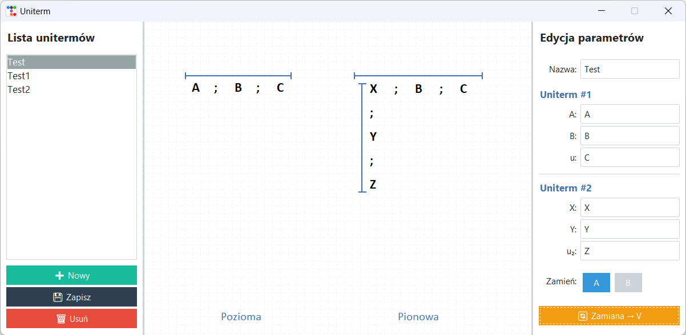

# Modelowanie i analiza systemu informatycznego realizującego zamianę poziomego unitermu na pionowy



## Opis projektu

Projekt przedstawia system informatyczny do modelowania i analizy procesu zamiany poziomej operacji eliminowania unitermów na operację pionową. Aplikacja umożliwia graficzne przedstawienie unitermów, ich edycję oraz transformację z formy poziomej do pionowej wraz z wizualizacją wyników.

## Technologie

* **Python 3.11**
* **Tkinter** (interfejs graficzny)
* **MySQL** (przechowywanie danych)

## Struktura projektu

```
uniterm/
│
├─ core/                  # Logika biznesowa
│  ├─ models.py           # Modele danych
│  ├─ repository.py       # Dostęp do bazy danych
│  ├─ services.py         # Funkcje operacji logicznych
│  └─ settings.py         # Konfiguracja projektu
│
├─ ui/                    # Interfejs graficzny
│  ├─ images/             # Zapisane obrazy
│  ├─ canvas_widget.py    # Widget do rysowania unitermów
│  ├─ dialogs.py          # Okna dialogowe
│  └─ main_window.py      # Główne okno aplikacji
│
├─ main.py                # Punkt startowy aplikacji
├─ requirements.txt       # Wymagane biblioteki
└─ schema.sql             # Schemat bazy danych
```

## Instalacja

### Wymagania wstępne

* Python 3.11+
* Serwer MySQL

### Kroki instalacji

1. Sklonuj repozytorium:

```bash
git clone https://github.com/kubazap/Uniterm
cd Uniterm
```

2. Zainstaluj wymagania:

```bash
pip install -r requirements.txt
```

3. Utwórz bazę danych MySQL i zaimportuj schemat:

```sql
CREATE DATABASE unitermdb CHARACTER SET utf8mb4;
USE unitermdb;

-- Import schema.sql
```

4. Uruchom aplikację:

```bash
python main.py
```

## Użycie aplikacji

* **Dodawanie unitermów** – użyj przycisku „Nowy”, wprowadź dane i zapisz.
* **Edycja unitermów** – wybierz istniejący uniterm z listy, zmień dane i zapisz.
* **Zamiana reprezentacji** – po wybraniu unitermu kliknij „Zamiana → V” aby wygenerować podgląd pionowy.
